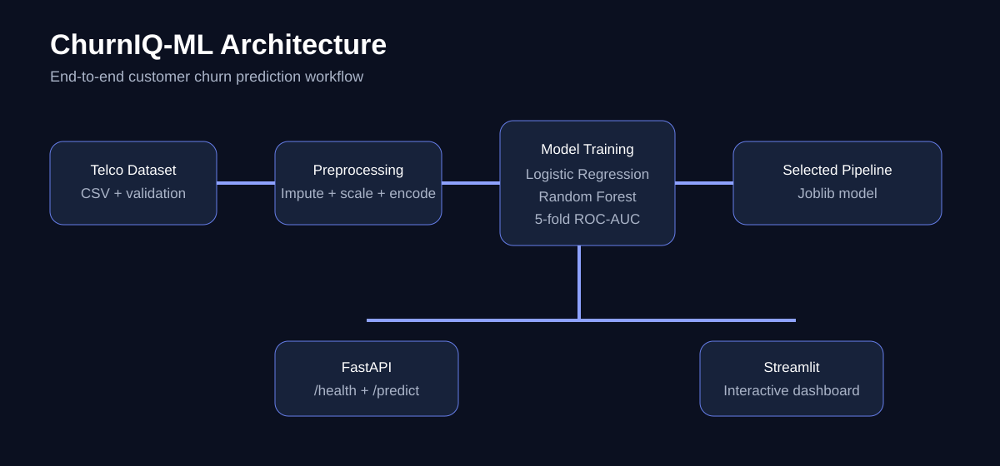
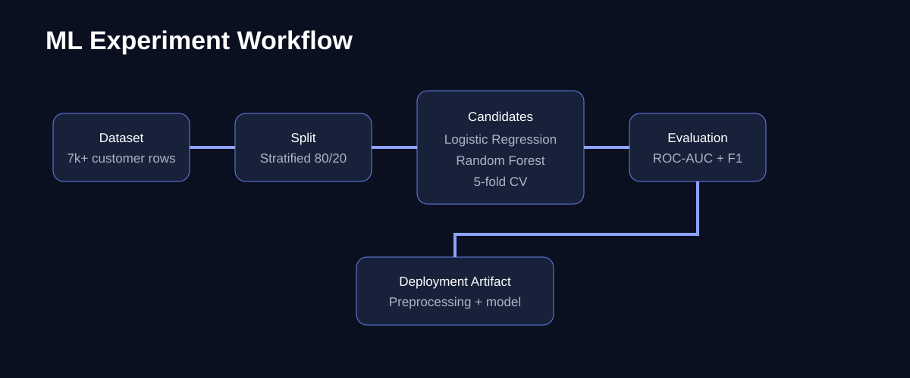

# ChurnIQ-ML — Customer Churn Prediction & Retention Intelligence

<p align="center">
  <strong>End-to-end machine learning project for predicting customer churn from telecom customer data.</strong>
</p>

<p align="center">
  <a href="https://churn-iq.streamlit.app/">🚀 Live Demo</a> ·
  <a href="https://github.com/Kraverse/ChurnIQ-ML">GitHub Repository</a>
</p>


## 🚀 Live Application

### [Open ChurnIQ-ML → https://churn-iq.streamlit.app/](https://churn-iq.streamlit.app/)

The live Streamlit application lets a user enter customer attributes and receive:

- Churn probability
- Binary churn-risk prediction
- Interactive customer inputs
- Model-backed inference using the trained preprocessing + classification pipeline

> **Deployment note:** The Streamlit app is configured to download the public sample dataset and prepare the model on first startup. Streamlit resource caching prevents unnecessary retraining during normal interaction.

---

## 📌 Project Overview

**ChurnIQ-ML** is an end-to-end supervised machine learning system built to demonstrate the complete ML application lifecycle:

```text
Data → Validation → Preprocessing → Model Training → Cross-Validation
     → Model Selection → Evaluation → Model Persistence → API → Dashboard
```

The project compares two classification approaches — **Logistic Regression** and **Random Forest** — using stratified cross-validation and ROC-AUC as the primary model-selection metric.

The resulting system includes both:

- A **FastAPI REST inference service**
- A **Streamlit interactive ML dashboard**

---

## 🖼️ Project Reference Images

### System Architecture



### ML Experiment Workflow



> The diagrams above are repository-generated architecture references and describe the actual project flow rather than being decorative mockups.

---

## 🎯 Problem Statement

Customer churn is a binary classification problem: given historical customer information, estimate whether a customer is likely to leave a service.

The project demonstrates how structured customer data can be transformed into a reproducible ML pipeline and exposed through a usable application.

### Example business use case

A telecom business could use a churn model as one input to identify customers who may need retention attention. Any real production deployment would require representative data, business validation, monitoring, calibration, privacy review and fairness analysis.

---

## 🧠 Machine Learning Pipeline

### 1. Dataset

The project uses the publicly documented **IBM Telco Customer Churn sample dataset**.

The dataset represents a fictional telecommunications business and is used for educational/portfolio purposes.

### 2. Data preparation

The pipeline:

- Converts `TotalCharges` to numeric values
- Handles missing numeric values with median imputation
- Handles missing categorical values with most-frequent imputation
- Standardizes numerical features
- One-hot encodes categorical features
- Removes `customerID` from model features
- Converts `Churn` from `Yes/No` into a binary target

### 3. Candidate models

| Model | Purpose |
|---|---|
| Logistic Regression | Interpretable linear classification baseline |
| Random Forest | Non-linear ensemble comparison |

### 4. Validation

- Stratified train/test split
- 5-fold `StratifiedKFold` cross-validation
- ROC-AUC used for model selection
- Held-out test set used for final evaluation

### 5. Metrics

The training pipeline records:

- Cross-validation ROC-AUC mean
- Cross-validation ROC-AUC standard deviation
- Test accuracy
- Test precision
- Test recall
- Test F1
- Test ROC-AUC

---

## 📊 Current Experiment Result

The latest verified training run selected **Logistic Regression** using mean 5-fold cross-validation ROC-AUC.

Recorded held-out test result:

| Metric | Logistic Regression |
|---|---:|
| CV ROC-AUC mean | **0.8459** |
| CV ROC-AUC std | **0.0124** |
| Test Accuracy | **0.7381** |
| Test Precision | **0.5043** |
| Test Recall | **0.7834** |
| Test F1 | **0.6136** |
| Test ROC-AUC | **0.8413** |

Random Forest is also evaluated during training and retained as a comparison candidate.

> These are experiment results on the sample dataset, not guarantees of future production performance.

---

## 🏗️ Application Architecture

```text
                    ┌──────────────────────┐
                    │ Telco Churn Dataset  │
                    └──────────┬───────────┘
                               ↓
                    ┌──────────────────────┐
                    │ Data Validation      │
                    │ + Feature Prep       │
                    └──────────┬───────────┘
                               ↓
                    ┌──────────────────────┐
                    │ Preprocessing        │
                    │ Impute / Scale / OHE │
                    └──────────┬───────────┘
                               ↓
                 ┌─────────────┴─────────────┐
                 ↓                           ↓
       ┌──────────────────┐        ┌──────────────────┐
       │ Logistic         │        │ Random Forest    │
       │ Regression       │        │ Classifier       │
       └────────┬─────────┘        └────────┬─────────┘
                └─────────────┬─────────────┘
                              ↓
                    ┌──────────────────────┐
                    │ CV + Model Selection │
                    └──────────┬───────────┘
                               ↓
                    ┌──────────────────────┐
                    │ Joblib Model         │
                    └──────────┬───────────┘
                         ┌──────┴──────┐
                         ↓             ↓
                 ┌─────────────┐ ┌─────────────┐
                 │ FastAPI     │ │ Streamlit   │
                 │ /predict    │ │ Dashboard   │
                 └─────────────┘ └─────────────┘
```

---

## 🌐 FastAPI REST API

The project includes a lightweight inference API.

### Health check

```http
GET /health
```

Example response:

```json
{
  "status": "ok",
  "model_available": true
}
```

### Prediction endpoint

```http
POST /predict
```

The endpoint accepts customer feature data and returns:

```json
{
  "churn_prediction": 1,
  "churn_probability": 0.73
}
```

Interactive API documentation is available locally at:

```text
http://127.0.0.1:8000/docs
```

---

## 🖥️ Streamlit Dashboard

The live dashboard provides a simplified customer prediction workflow.

Current input groups include:

- Tenure
- Monthly charges
- Contract type
- Internet service
- Payment method
- Senior citizen indicator
- Partner status
- Dependents
- Paperless billing

After prediction, the application displays the estimated churn probability and the model's binary risk result.

### Live dashboard

**https://churn-iq.streamlit.app/**

---

## 🔬 Engineering Details

### Leakage-safe preprocessing

Preprocessing is implemented inside scikit-learn pipelines so transformations are fitted as part of the training workflow rather than manually applied before validation.

### Reproducibility

The project uses fixed random states for the major train/test split, cross-validation and model components.

### Model persistence

The selected pipeline is saved using Joblib. The persisted pipeline contains the preprocessing stages and trained estimator together, reducing the risk of applying inconsistent transformations during inference.

### CI

GitHub Actions verifies the project through automated linting, tests and the ML training/evaluation workflow.

---

## 🧪 Testing

Run the complete local test suite with:

```bash
python -m pytest -q
```

The verified local test result is:

```text
5 passed
```

A Starlette/AnyIO deprecation warning may appear from the installed test dependency; it does not fail the test suite.

---

## ⚙️ Run Locally

### 1. Clone

```bash
git clone https://github.com/Kraverse/ChurnIQ-ML.git
cd ChurnIQ-ML
```

### 2. Create the Python environment

Windows Git Bash:

```bash
py -3.11 -m venv .venv
source .venv/Scripts/activate
```

### 3. Install dependencies

```bash
python -m pip install -r requirements.txt
```

### 4. Download the dataset

```bash
python scripts/download_data.py
```

### 5. Train and evaluate

```bash
python scripts/train.py
```

This writes the trained model under `models/` and experiment metrics under `reports/`.

### 6. Run tests

```bash
python -m pytest -q
```

### 7. Run FastAPI

```bash
uvicorn app.api.main:app --reload
```

### 8. Run Streamlit

```bash
streamlit run app/streamlit_app.py
```

---

## 📁 Repository Structure

```text
ChurnIQ-ML/
│
├── app/
│   ├── api/
│   │   └── main.py              # FastAPI inference service
│   └── streamlit_app.py         # Interactive ML dashboard
│
├── src/churniq/
│   ├── data.py                  # Dataset validation/loading
│   ├── pipeline.py              # Feature preparation + ML pipelines
│   ├── train.py                 # Training/model comparison logic
│   ├── evaluate.py              # Evaluation/report generation
│   └── config.py                # Project configuration
│
├── scripts/
│   ├── download_data.py         # Dataset download
│   └── train.py                 # Training entry point
│
├── tests/
│   ├── test_api.py
│   ├── test_data.py
│   └── test_pipeline.py
│
├── docs/
│   ├── churniq-architecture.svg
│   └── churniq-ml-workflow.svg
│
├── data/raw/                    # Raw dataset location
├── reports/                     # Generated metrics
├── models/                      # Generated model artifact
├── .github/workflows/ci.yml     # GitHub Actions CI
├── MODEL_CARD.md                # Model documentation
├── requirements.txt
└── README.md
```

---

## 🛠️ Technology Stack

| Area | Technologies |
|---|---|
| Language | Python |
| ML | scikit-learn |
| Data | pandas, NumPy |
| Model persistence | Joblib |
| API | FastAPI, Pydantic |
| UI | Streamlit |
| Testing | pytest |
| Code quality | Ruff |
| CI/CD | GitHub Actions |
| Deployment | Streamlit Community Cloud |
| Version control | Git + GitHub |

---

## 📚 Project References

### Dataset

The project uses the IBM Telco Customer Churn sample dataset for educational and portfolio purposes.

- IBM Telco Customer Churn repository/data reference: https://github.com/IBM/telco-customer-churn-on-icp4d

### Core project files

- [`app/streamlit_app.py`](app/streamlit_app.py) — live dashboard implementation
- [`app/api/main.py`](app/api/main.py) — REST inference API
- [`src/churniq/pipeline.py`](src/churniq/pipeline.py) — preprocessing and model definitions
- [`scripts/train.py`](scripts/train.py) — training/evaluation entry point
- [`MODEL_CARD.md`](MODEL_CARD.md) — intended use, methodology and limitations
- [`tests/`](tests/) — automated tests

---

## 🔗 Related Projects

Other AI/software projects in the same portfolio:

| Project | Focus | Reference |
|---|---|---|
| **HelpDesk AI** | Enterprise RAG assistant using LangChain + Gemini | https://github.com/Kraverse/HelpDesk-AI-Enterprise-RAG-Assistant |
| **DhobiXpert** | Production laundry-service web platform | https://dhobyexpert.vercel.app/ |
| **KraVerse AI** | Personal AI assistant / portfolio integration | https://github.com/Kraverse/KraverseAI |
| **KraVoice** | Speech/audio transcription application | https://github.com/Kraverse/KraVoice |

---

## 🧾 Resume-Ready Project Description

**ChurnIQ-ML — Customer Churn Prediction System**  
Built an end-to-end supervised ML pipeline using Python and scikit-learn to predict telecom customer churn, comparing Logistic Regression and Random Forest with stratified 5-fold ROC-AUC validation. Implemented leakage-safe preprocessing, automated evaluation, Joblib model persistence, FastAPI inference endpoints, GitHub Actions CI, and a live Streamlit prediction dashboard.

---

## ⚠️ Limitations & Responsible Use

This project is a portfolio/educational ML system using a public sample dataset representing a fictional telecommunications business.

The predictions should **not** be treated as definitive decisions about individual customers. A real deployment would require:

- Representative production data
- Data-quality monitoring
- Model-performance monitoring
- Probability calibration
- Fairness analysis
- Privacy and security review
- Business validation
- Drift detection
- Retraining strategy
- Human oversight

See [`MODEL_CARD.md`](MODEL_CARD.md) for additional model-use guidance.

---

## 👤 Author

**Kartik Suresh Katke**  
Computer Science Engineering — Artificial Intelligence & Machine Learning  
Mumbai University

- GitHub: https://github.com/Kraverse
- LinkedIn: https://www.linkedin.com/in/kraverse/
- Live ChurnIQ-ML: https://churn-iq.streamlit.app/

---

## ⭐ If you find this project useful

Feel free to explore the repository, try the live dashboard, and inspect the training, evaluation, API and testing workflow.
